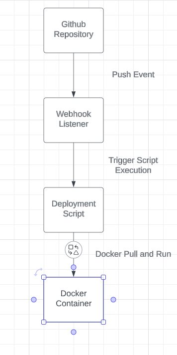

### CD Project Overview:
- **What are you doing**: The project automates the process of building a Docker image for the project and pushing it to DockerHub whenever a Git tag is pushed to your GitHub repository.
- **Why**: Automation of the deployment process ensures that your Docker image is up-to-date.
- **What tools**:
    - **GitHub Actions**: Used to define workflows that automate the deployment process.
    - **Docker**: Utilized for building and managing containerized applications.
    - **DockerHub**: Used as the container registry to store and distribute Docker images.



### How to generate a tag in Git / GitHub:
To generate a tag in Git/GitHub, follow these steps:
1. **Git command**: Use the `git tag` command followed by the version number to create a new tag. For example:
   ```bash
   git tag v1.0.0

# Behavior of GitHub workflow
The GitHub workflow defined in the `.github/workflows` directory is triggered whenever a tag is pushed to the repository. Here's what it does:

- **Checkout repository**: Fetches the latest code from the repository.
- **Login to DockerHub**: Authenticates with DockerHub using provided credentials stored as secrets.
- **Build Docker image**: Builds a Docker image for the project.
- **Determine Git tag**: Retrieves the Git tag associated with the commit.
- **Push Docker image to DockerHub**: Tags the Docker image with the Git tag and `latest`, then pushes the images to DockerHub.

# What does it do and when
- **What**: Automatically builds and pushes Docker images to DockerHub.
- **When**: Whenever a Git tag is pushed to the repository. This allows you to trigger the deployment process when you're ready to deploy a new version of your project.

## Dockerhub Link
https://hub.docker.com/repository/docker/hastings2002/project_4/general

# How to install Docker to your instance
1. **Update your package index**:
   ```bash
   sudo apt update
   
2. **Install necessary dependencies to use the repository over HTTPS**:
   ```bash
   sudo apt install apt-transport-https ca-certificates curl software-properties-common
   
3. **Add Docker’s official GPG key**:
    ```bash
   curl -fsSL https://download.docker.com/linux/ubuntu/gpg | sudo apt-key add -
   
4. **Add Docker repository to your APT sources**:
    ```bash
   sudo add-apt-repository "deb [arch=amd64] https://download.docker.com/linux/ubuntu $(lsb_release -cs) stable"

5. **Update the package index again**:
    ```bash
   sudo apt update
   
6. **Install Docker CE (Community Edition)**:
    ```bash
   sudo apt install docker-ce

## Docker Image and Container Management Script

### Justification:

This script automates the process of updating and restarting a Docker container from a Docker Hub image. It helps streamline deployment processes by pulling the latest image version and restarting the container with minimal manual intervention.

### Description:

The script performs the following steps:
1. Pulls the latest image from Docker Hub.
2. Stops the running container.
3. Removes the stopped container.
4. Runs a new container with the updated image.

### Location on the Instance:

The script should be placed in a directory where it can be easily accessed and executed, such as `/usr/local/bin` or a directory specific to deployment scripts, such as `~/deployment`.

### Script:
```
#!/bin/bash
# Pull the latest image from DockerHub
docker pull <your_image_name>

# Stop the running container
docker stop <container_name>

# Remove the stopped container
docker rm <container_name>

# Run a new container with the updated image
docker run -d -p <host_port>:<container_port> --name <container_name> <your_image_name>'
```
