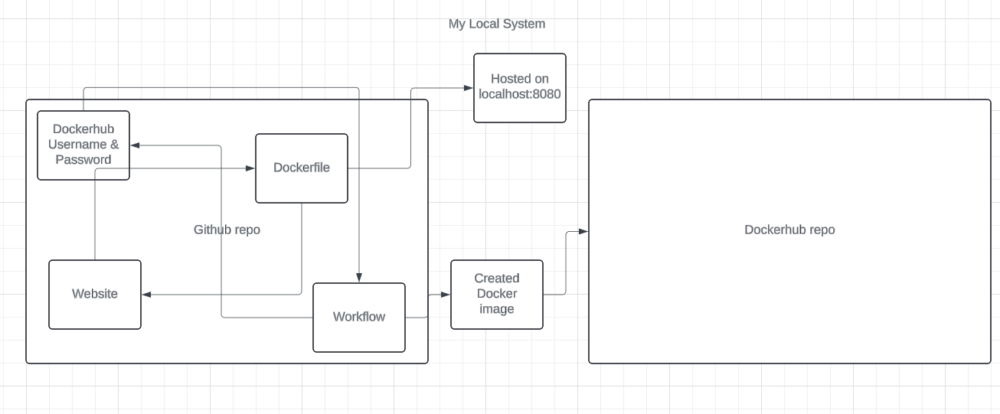

### What I am doing
* I am creating a website and using docker to create a container that includes an image of my website.
* That container can be used to run and see my website

### Why I am doing
* The reason I am doing this is to track and control my code better.
* With docker, I can have separate environments that I move my codd to after certain things have been met.
* For example, once I have a grid on my website, we can move the code from Development to Stage and then from Stage to Production

### Tools (I have a mac)
* Docker Desktop
* apache2
* my brain :)

### How to run locally
* First, make sure you have docker desktop installed
* Then make sure you have apache2 installed
* command to build the image from the docker file is `docker build -t my-apache-server .`
* command to run the container is `docker run -d -p 8080:80 my-apache-server`
* find the website by putting `http://localhost:8080` in a URL search

### create public repo in ducker hub
* Open up docker hub in a web browser
* Log in
* click repositorys at the top
* click blue create repository
* make sure visibility is Public

### authenticate 
* use `docker login`
* you'll then be prompted to enter username and password
* make sure when you are done to do `docker logout`

### How to push container image to Dockerhub (without GitHub Actions)
* tag image with `docker tag <image_id> <dockerhub_username>/<repository_name>:<tag>`
* login using `docker login`
* push the image using `docker push <dockerhub_username>/<repository_name>:<tag>`
* make sure to loggout using `docker logout`

### dockerhub reposiitory
* https://hub.docker.com/repository/docker/hastings2002/project_4/general

### Configuring GitHub Secrets
* a secret is something that GitHub can grab and use without it being stored in your codebase
for everyone to see
* the two secrets set for this project are my dockerhub username and password, so I can
push images to my dockerhub repo without people seeing my password.

### Behavior of GitHub workflow
* a GitHub workflow will run code during different times. You can set those times to whatever you want,
for example, it could be after every commit, or it could just be nightly, or it could just be when you tell it to
run
* variables in my workflow that would need to be updated are things like my dockerhub username and the repo
it's going into

